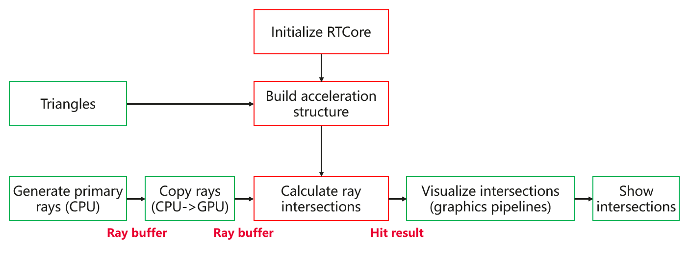
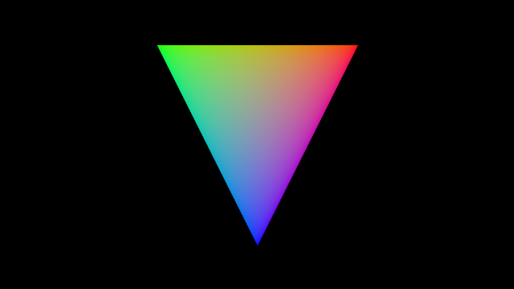
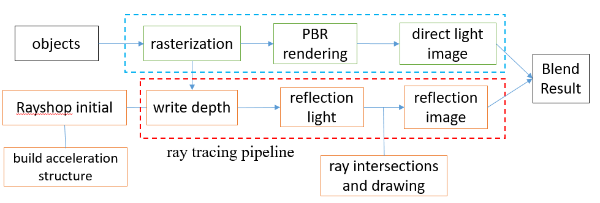
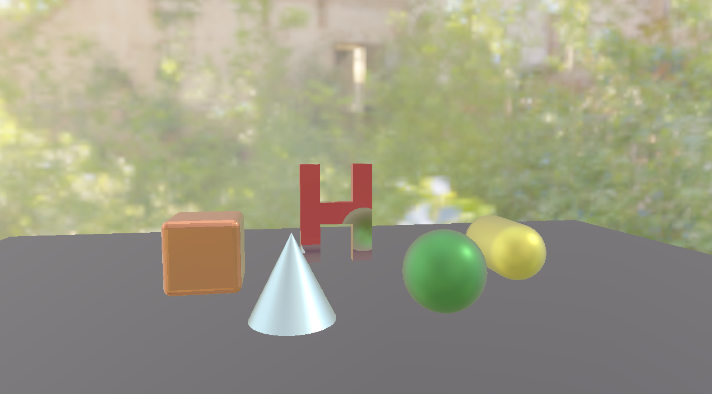

# Sample Codes for RTCore
[中文](https://github.com/HMS-Core/hms-scene-RTcore-demo/blob/master/README_zh.md) | English
## Contents

* [Introduction](#introduction)
* [Compilation](#compilation)
* [Demos](#demos)
* [Reference_Projects](#reference_projects)
* [License](#license)

## Introduction
This project mainly demonstrates how to use RTCore APIs to build hybrid rendering pipelines and simulate partial reflection in ray tracing. It provides two demos: one for drawing a triangle using RTCore APIs, and the other for implementing physically based rendering (PBR) pipelines and simulating partial reflection based on hybrid rendering.
In this project, we make use of Vulkan by referring to SaschaWillems' VulkanExample[[1]](https://github.com/SaschaWillems/Vulkan) project. In the demo of drawing a triangle, the primary ray for each pixel on the screen is calculated by referring to Ray Tracing in One Weekend[[3]](https://raytracing.github.io/books/RayTracingInOneWeekend.html). PBR-related functions are implemented by referring to LearnOpenGL[[2]](https://learnopengl-cn.github.io/07%20PBR/02%20Lighting/#pbr).

## Compilation
The two demos have been tested on Android platforms and contain all necessary configuration files.
**Android platform**
1\. Development Environment
* Android studio 4.0 or later
* ndk 21.0.6113669 or later
* Android SDK 31.0.0 or later

2\. Open `VulkanRTCoreExample\android` in Android Studio and synchronize the project. Run the project to generate the APK and install it on a Huawei phone. Then launch the app to check whether it works as expected.

## Demos
### [Drawing a Triangle using Ray Tracing](examples/triangle)
This demo shows you how to use RTCore APIs to calculate the intersections between primary rays and triangles, to replace the original rasterization method. Below is the detailed procedure.

1\. Use the `generatePrimary` function in `RaytracingTriangle.cpp` to calculate primary rays in the World Coordinate System (WCS) based on the camera coordinates and pixel coordinates.

2\. Use the `updateRayBuffers` function in `RaytracingTriangle.cpp` to copy rays from CPU to GPU.

3\. Build bvh and calculate the ray intersections. This task includes three steps: **performing initialization**, **building an acceleration structure**, and **calculating the ray intersections**, framed in red in the preceding figure. In this demo, RTCore APIs is used in the `VulkanTraceRay` class.

* The `prepare` function obtains **compute queue** and call the `Setup` function of RTCore to perform initialization.
* `buildBVH(vertices, indices, modelMatrix)` first converts vertex coordinates into WCS coordinates, and then calls the `CreateBLAS` and `CreateTLAS` functions to build the bottom-level and top-level acceleration structures, respectively.
* The `trayRay` function calls the **TraceRays** API of RTCore to calculate the ray intersections and get the calculation result. Below is the result.

4\. Use graphics pipelines to virtualize the intersections. That is, call the `triangle/VulkanTrianglePipeline` class to process pixels one by one, obtain the intersection calculation result, and show the intersections in a specific color.

### [Simulating Partial Reflection Based on Hybrid Rendering](examples/hybridreflection)
This demo builds a set of ray tracing-based hybrid rendering pipelines to implement partial reflection. Below is the detailed procedure.

1\. Use the traditional rasterization method to implement PBR pipelines (as shown in the area framed by yellow dotted lines). Here is the code:

* `examples/hybridreflection/VulkanScenePipeline`
* `examples/hybridreflection/VulkanImageBasedLighting`
* `examples/hybridreflection/VulkanSkyboxPipeline`;

2\. Rasterize reflective objects through graphics pipelines, and use the vertex WCS coordinates, normal vectors, and camera coordinates to get specular reflection rays.
* `examples/hybridreflection/VulkanGenReflecRayPipeline`

3\. Similar to the demo for drawing a triangle, use RTCore to build an acceleration structure for a scene and calculate the ray intersections. Here, rays generated using graphics pipelines are available in the GPU.
4\. Traverse material information of all possible reflective objects in the scene based on the intersection calculation result, and color the intersections through PBR to obtain specular maps.
* `examples/hybridreflection/VulkanReflectionPipeline`

5\. Use a hybrid pipeline to fuse specular maps and images displayed by original graphics pipelines.
* `examples/hybridreflection/VulkanOnscreenPipeline`

Below is an example of partial reflection:

Remarks: The GLTF materials provided by Huawei contain six objects to be reflected: "Huawei", "Cone", "Sphere", "Capsule", "Cube", "Plane". You can use the `setDrawMeshName` function in `hybridreflection.cpp` to select the objects that require reflection.

## Reference_Projects
[1] https://github.com/SaschaWillems/Vulkan

[2] [learnOpenGL/PBR](https://learnopengl-cn.github.io/07%20PBR/02%20Lighting/#pbr)

[3] https://raytracing.github.io/books/RayTracingInOneWeekend.html

## License
The sample code is licensed under Apache License 2.0. Please refer to  [LICENSE.md](LICENSE.md)  for more information.
