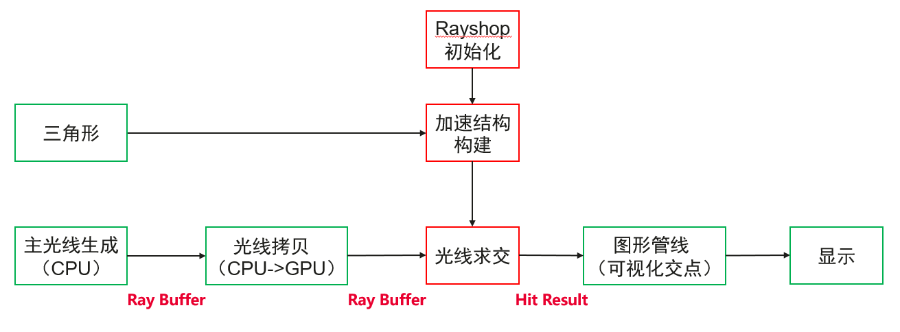
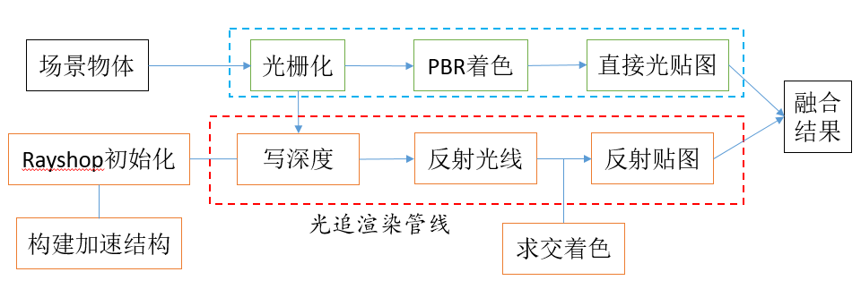

# 光线追踪内核使用的示例代码

[English](README.md) | 中文

## 目录
* [简介](#简介)
* [编译](#编译)
* [例子](#例子)
* [参考项目](#参考项目)
* [许可证](#许可证)

## 简介
本项目主要是用于展示如使用华为提供的移动端光线追踪内核，搭建混合渲染管线以及实现局部光追反射效果。项目中关于Vulkan封装参考了SaschaWillems的VulkanExample[[1]](https://github.com/SaschaWillems/Vulkan)项目，例子中关于PBR部分知识参考了LearnOpenGL[[2]](https://learnopengl-cn.github.io/07%20PBR/02%20Lighting/#pbr), 在画三角形的例子中，关于屏幕上每个像素点主光线计算原理参考了Ray Tracing in One Weekend[[3]](https://raytracing.github.io/books/RayTracingInOneWeekend.html)。
本项目涉及2个Demo：（1）通过光线追踪内核画一个三角形；（2）实现PBR的渲染管线，并在此基础上搭建基于混合渲染的反射效果；

## 编译
目前所有例子均在Android平台测试过，且包含了所需要的所有配置文件。
**Android平台**
1\. 开发环境
* Android studio 4.0及以上版本
* ndk 21.0.6113669及以上版本
* Android SDK 31.0.0及以上版本

2\.用Android studio打开VulkanRTCoreExample\android目录，同步后，在您的华为手机上运行示例代码；

## 例子
### [光线追踪画三角形](examples/triangle)
本例子展示光线追踪内核最基本的使用，利用光线追踪对主光线与三角形求交来替代原有的光栅化的过程。整体流程如下图所示。

1\. 通过相机坐标与屏幕上像素点的坐标计算世界坐标系的主光线（RaytracingTriangle.cpp 中 `generatePrimary`函数）；

2\. 将光线从CPU侧拷贝到GPU侧（tiangle.cpp中`updateRayBuffers`函数）；

3\. 光线构建求交（上图中红框部分），主要包含**求交构建初始化**，**加速结构构建**，**光线求交**这三部分，我们着重介绍这三个部分。在现有的例子中，我们在`VulkanTraceRay`类中对光追内核进行了调用：

* `prepare`函数获取compute queue并调用光追内核的`Setup`函数进行初始化；
*  `buildBVH(vertices,  indices, modelMatrix)` 首先将顶点转换到世界坐标系，再调用`CreateBLAS`与`CreateTLAS`函数进行底层与顶层加速结构的构建；
* `trayRay` 函数调用光追内核的TraceRays接口进行求交，然后求交结果, 效果如下图所示：

4\. 利用图形管线可视化交点结果，`triangle/VulkanTrianglePipeline`类对整个屏幕逐像素处理获取求交结果并输出颜色。

### [用混合渲染管线实现局部反射](examples/hybridreflection)
本例子搭建了一套基于光线追踪的混合渲染管线，实现了光追局部反射的后处理效果，具体流程如下图。

1\. 通过传统光栅化的方法，实现了PBR的渲染管线(图中黄色虚线部分)，具体参考代码： 
* `examples/hybridreflection/VulkanScenePipeline`
* `examples/hybridreflection/VulkanImageBasedLighting`
* `examples/hybridreflection/VulkanSkyboxPipeline`;

2\.  反射物体经过图形管线进行光栅化，利用中间计算的世界坐标系与法向量以及相机坐标得到镜面反射的反射光线：
* `examples/hybridreflection/VulkanGenReflecRayPipeline`

3\. 与上一个例子一样，调用光追内核对场景进行加速结构构建以及光线求交, 此处利用图形管线生成的光线已经在GPU侧，不需要拷贝；
4\. 利用求交结果遍历场景中所有可能的被反射物体的材质信息，对交点进行PBR着色，得到反射贴图：
* `examples/hybridreflection/VulkanReflectionPipeline`

5\. 最后利用一个一条融合管线，将反射贴图与原始管线显示的图像进行融合：
* `examples/hybridreflection/VulkanOnscreenPipeline`

最终局部反射的效果如下图所示：

备注: 在我们提供的GLTF素材中，共包含：“Huawei”， “Cone”, “Sphere”, “Capsule”, “Cube”, “Plane” 6个待反射物体，我们可以在`hybridreflection.cpp`中通过`setDrawMeshName`函数选择哪些物体需要反射效果。

## 参考项目
[1] https://github.com/SaschaWillems/Vulkan

[2] [learnOpenGL/PBR](https://learnopengl-cn.github.io/07%20PBR/02%20Lighting/#pbr)

[3] https://raytracing.github.io/books/RayTracingInOneWeekend.html

## 许可证
光追内核示例代码采用的许可证为Apache License, version 2.0，参考 [LICENSE.md](LICENSE.md) 获取更多许可证信息；
