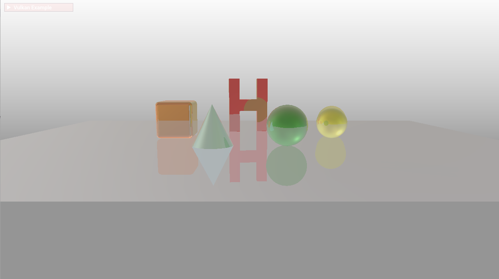

# 光线追踪内核使用的示例代码

[English](README.md) | 中文

## 目录

* [简介](#简介)
* [编译](#编译)
* [例子](#例子)
* [参考项目](#参考项目)
* [许可证](#许可证)

## 简介

本项目主要是用于展示如使用华为提供的移动端光线追踪内核，搭建混合渲染管线以及实现局部光追反射效果。项目中关于Vulkan封装参考了SaschaWillems的VulkanExample[[1]](https://github.com/SaschaWillems/Vulkan)项目，例子中关于PBR部分知识参考了LearnOpenGL[[2]](https://learnopengl-cn.github.io/07%20PBR/02%20Lighting/#pbr), 在画三角形的例子中，关于屏幕上每个像素点主光线计算原理参考了Ray Tracing in One Weekend[[3]](https://raytracing.github.io/books/RayTracingInOneWeekend.html)。

本项目涉及2个Demo：（1）通过光线追踪内核画一个三角形；（2）实现PBR的渲染管线，并在此基础上搭建基于混合渲染的反射效果；

## 编译

目前所有例子均在Android / HarmonyOS平台测试过，且包含了所需要的所有配置文件。

**运行在 Android / HarmonyOS 平台**

1\. 开发环境

* Android studio 4.0及以上版本
* ndk 20.1.5948944及以上版本
* Android SDK 29.0.0及以上版本
* 设置环境变量ANDROID_HOME ANDROID_NDK_HOME分别指向 Android SDK目录和NDK目录

2\. 编译运行

2.1 使用IDE

用Android Studio打开`android`目录，同步后，连接手机，点击运行按钮或快捷键Shift+F10即可执行代码

生成的apk文件归档在android\examples\bin目录下。

2.2 使用命令行

USB连接手机，开启ADB调试模式，执行以下命令

```bat
cd android
call .\gradlew clean
call .\gradlew installDebug 	# or `call .\gradlew assembleDebug` for just build apk
adb shell am start -n "com.huawei.rtcore.vkhybridrt/.VulkanActivity"
```


## 例子
### [光线追踪画三角形](examples/triangle)
本例子展示光线追踪内核最基本的使用，利用光线追踪对主光线与三角形求交来替代原有的光栅化的过程。整体流程如下图所示。


1\. 通过相机坐标与屏幕上像素点的坐标计算世界坐标系的主光线（RaytracingTriangle.cpp 中 `generatePrimary`函数）；

2\. 将光线从CPU侧拷贝到GPU侧（tiangle.cpp中`updateRayBuffers`函数）；

3\. 光线构建求交（上图中红框部分），主要包含**求交构建初始化**，**加速结构构建**，**光线求交**这三部分，我们着重介绍这三个部分。在现有的例子中，我们在`VulkanTraceRay`类中对光追内核进行了调用：


* `prepare`函数获取compute queue并调用光追内核的`Setup`函数进行初始化；
*  `buildBVH(vertices,  indices, modelMatrix)` 首先将顶点转换到世界坐标系，再调用`CreateBLAS`与`CreateTLAS`函数进行底层与顶层加速结构的构建；
* `trayRay` 函数调用光追内核的TraceRays接口进行求交，然后求交结果, 效果如下图所示：


4\. 利用图形管线可视化交点结果，`triangle/VulkanTrianglePipeline`类对整个屏幕逐像素处理获取求交结果并输出颜色。

### [用混合渲染管线实现局部反射](examples/hybridreflection)
本例子搭建了一套基于光线追踪的混合渲染管线，实现了光追局部反射的后 处理效果，具体流程如下图。


1\. 通过传统光栅化的方法，实现了PBR的渲染管线(图中黄色虚线部分)，具体参考代码： 

* `examples/hybridreRayTracing/HybridRayTracing`
* `base/VulkanScenePipeline`
* `base/VulkanImageBasedLighting`
* `base/VulkanSkyboxPipeline`

2\.  用于生成反射贴图的光追渲染管线，调用光追内核接口搭建管线所需的资源，在着色器代码中生成反射光线，与场景求交，获取颜色，得到反射贴图：

* `examples/hybridreRayTracing/RayTracingPass`
* `data/shaders/glsl/hybridRayTracing/raytracing_color.frag`

3\. 最后利用一个一条融合管线，将反射贴图与原始管线显示的图像进行融合：

* `examples/hybridreRayTracing/VulkanOnscreenPipeline`

最终得到反射的效果图如下：


## 参考项目
[1] https://github.com/SaschaWillems/Vulkan

[2] [learnOpenGL/PBR](https://learnopengl-cn.github.io/07%20PBR/02%20Lighting/#pbr)

[3] https://raytracing.github.io/books/RayTracingInOneWeekend.html

## 许可证
光追内核示例代码采用的许可证为Apache License, version 2.0，参考 [LICENSE.md](LICENSE.md) 获取更多许可证信息；
